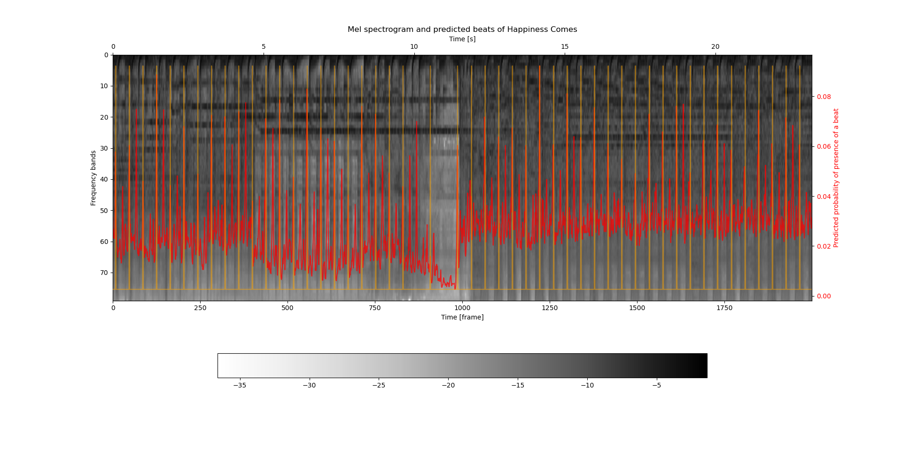
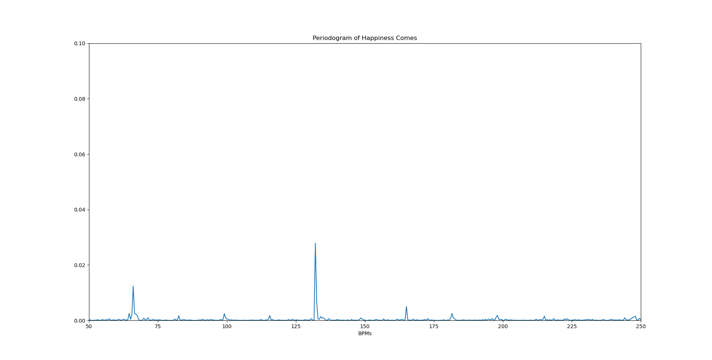
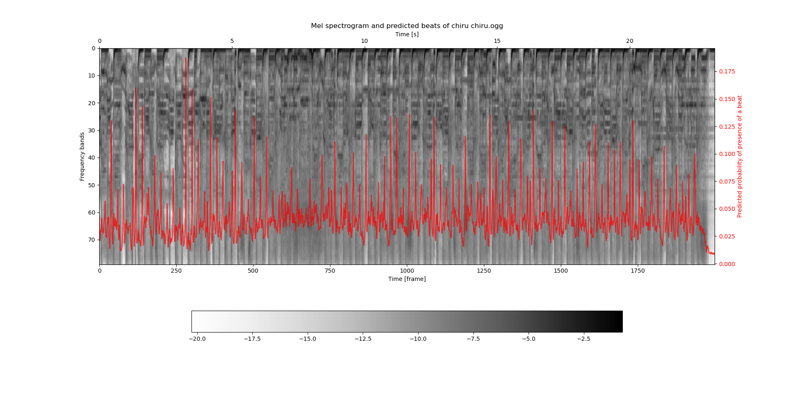
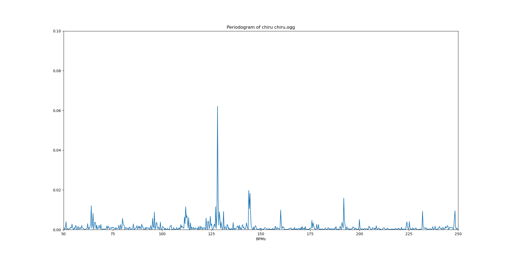

# Tempo prediction using CNN

## Introduction

This project was inspired by [ddc/chrisdonahue](https://github.com/chrisdonahue/ddc) [[1]](#1)
and a paper from J.Schlüter and S.Böck: "Improved musical onset detection with
Convolutionnal Neural Networks" [[2]](#2).

### Goal

The goal of this project is to extract the locations of beats and global bpm of
a song using the methodology and neural network architecture defined by 
[[2]](#2) for musical onset detection and datasets from [[1]](#1).

### Principles

Following [[2]](#2), the audio data is decomposed into 3 Mel-scaled spectrograms 
with different window lengths and 80 frequency bands. Each frame is then fed
into the model with a context of +/- 7 frames, which very roughly corresponds
to a total of 150 ms of audio, each input is therefore a tensor of dimension 
15x80x3.

The Neural Network itself consists in 2 convolutionnal layers, the first with
a rectangular kernel wider in time than frequency, while the second one uses
a square kernel. Each of these two layers are followed by max-pooling in the
frequency dimension. These layers are followed by 3 fully-connected layers with
50% dropout each. The last layer uses a sigmoid activation function and gives
the probability of the frame considered being a beat. Every other layer uses
reLU activation.

To extract the bpm from the beat prediction, the periodogram of the prediction
series is computed, which allows us to isolate the bpm of the song with peak
picking.

More work is to be done to isolate the precise location of each beat.

### Training Method

The data used come from the rythm videogame Stepmania, which is a great source
of annotations for musical files, as pointed in [[1]](#1). More precisely,
the network is trained on a combination of the `Fraxtil` and `ITG` datasets
from [[1]](#1), which were the highest quality Stepmania packs I was
able to find, in regard to beat annotations at least.

The training was done minimizing binary cross entropy between the predictions
and the annotations from the dataset, with "mini batches" of 16 songs. The Adam
optimizer from the keras API was used to apply the mean gradient of the mini
batch. Training was done for 600 epochs. Overfitting did not seem to appear 
after 600 epochs, which suggests there is more room for improvement via more
training.

The dataset was split between:
- A training dataset (90%)
- A validation dataset (10%)
- A testing dataset (10%)

## Dependencies

- Tensorflow 2
- Essentia

## Usage

Incoming

## Results

The model is correctly predicting the positions of beats, as we can
see on the following plots, realized for a song present in the test dataset,
Happiness Comes from Reflection Theory (in orange are figured the annotations
for the beats).

However, if the model is correctly predicting the beats in most cases, he also
seems to be predicting eighth notes between two beats. This can be explained by
a similarity between quarter notes (beats) and eighth notes in the genres
present in the dataset. Nonetheless, the BPM can still be predicted by
searching peaks in the periodogram between 100 BPM and 200 BPM which is a common
range of tempo for music: using this method, the model correctly predicts a
tempo of 132 BPM.

Here are results for a song that does not come from the dataset: [Chiru Chiru
By REOL](https://www.youtube.com/watch?v=VVaNq9uSJgY).

For Chiru Chiru, the model correctly predicts a tempo of 128 BPM.

## Still to do
- More training, for longer times
- Implementing early stopping
- Isolating precises location of each beat
- Improve on the NN architecture

## References

<a id="1">[1]</a>
Donahue, Chris & Lipton, Zachary & McAuley, Julian. (2017). Dance Dance Convolution. 

<a id="2">[1]</a>
J. Schlüter and S. Böck, "Improved musical onset detection with Convolutional Neural Networks," 2014 IEEE International Conference on Acoustics, Speech and Signal Processing (ICASSP), Florence, 2014, pp. 6979-6983, doi: 10.1109/ICASSP.2014.6854953.
